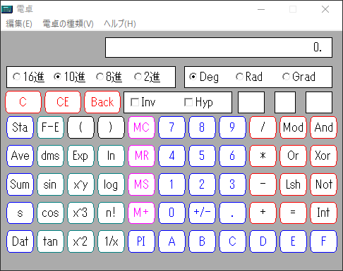

# winevdm on 64-bit Windows



[Download stable version](https://github.com/otya128/winevdm/releases)

[Download latest version (unstable, slower than stable version)](https://ci.appveyor.com/project/otya128/winevdm/build/artifacts)

16-bit Windows (Windows 1.x, 2.x, 3.0, 3.1, etc.) on 64-bit Windows

An altered version of winevdm (a 16-bit Windows emulator), ported to 64-bit Windows.

# How to compile

+ Install Visual Studio 2017
+ Install binutils
+ Edit PropertySheet.props
+ Compile

# How to install

+ Download or compile
+ Edit install.reg
+ Register install.reg
+ You can execute Win16 binaries directly!

**If you install v0.4.x, you should add these to install.reg and register install.reg again.**
```ini
[HKEY_LOCAL_MACHINE\SOFTWARE\WOW6432Node\Microsoft\Windows NT\CurrentVersion\NtVdm64\OTVDM]
"CommandLine"="\"%m\" %c"
"InternalName"="*"
"MappedExeName"="C:\\PATH\\TO\\otvdm.exe"
"ProductName"="*"
"ProductVersion"="*"
```

# How does it work?

This program contains the following items

+ CPU Emulator
  + 64-bit Windows cannot modify LDT(NtSetInformationProcess(,ProcessLdtInformation,,) always returns error)
+ wine based Win16->Win32 conversion codes:
```c
BOOL16 WINAPI DestroyWindow16( HWND16 hwnd )
{
    return DestroyWindow( WIN_Handle32(hwnd) );
}
```
Relay routines from 16-bit to 32-bit are autogenerated by convspec
```spec
53  pascal -ret16 DestroyWindow(word) DestroyWindow16
```
+ DOS emulation for Win16
+ 16-bit <=> native HANDLE conversion
+ Fix compatibility problems, fix compatibility problems

## install.reg

When 64-bit Windows detects a 16-bit installer, it has a mechanism to start an alternative installer which is not 16-bit.
This program uses it.

## WINDOWS directory redirection

Some Win16 programs try to save their settings in %WINDIR%\<filename>.ini

In recent Windows, it is not allowed to save to %WINDIR%, so it redirects.

# winevdm
```bat
winevdm.exe [--app-name app.exe] command line
winevdm.exe CALC.EXE
```
It can also run DOS executables (DOS emulator-like).
You can set the DOS version with the VDMDOSVER environment variable.

